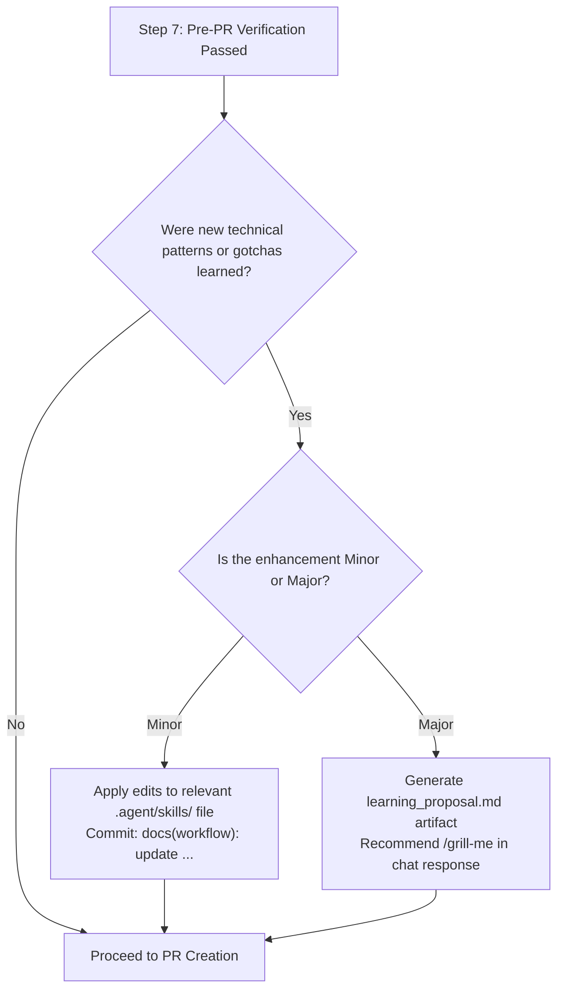

# Evolutionary Workflow Protocol — SiagaKita

This document defines the **Evolutionary Workflow Protocol** for SiagaKita. It governs how AI agents and engineers institutionalize lessons learned during feature implementation, preventing workflow rot and continually refining repository skills without human micromanagement.

Sub-file of [SKILL.md](SKILL.md).

---

## 1. Core Principles

1. **Continuous Feedback Loop**: Every solved technical problem, discovered CLI quirk, or debugging breakthrough is a permanent institutional asset, not ephemeral session memory.
2. **Strict Safety Boundaries**: The agent must maintain a clear, immutable demarcation between low-risk **Minor** enhancements (applied autonomously) and high-impact **Major** evolutions (proposed for human review).
3. **Context Hygiene & Anti-Bloat**: Skill documents must remain dense, pragmatic, and readable. Never bloat skills with verbose transcript logs, duplicated instructions, or dead prototypes.

---

## 2. Classification Matrix: Minor vs. Major

| Dimension | Minor Updates (Autonomous Execution) | Major Updates (Proposal & Review Required) |
|---|---|---|
| **Scope** | Technical gotchas, CLI flags, path corrections, testing tips, database tricks, catalog synchronization. | CI/CD pipelines, review gates, branching strategy, database rollback policies, new skills. |
| **Target Files** | `testing.md`, `postgres-patterns.md`, `backend-standards.md`, `flutter-standards.md`, `.agent/skills/README.md`. | `.github/workflows/*.yml`, `review-standards.md`, `devops-workflow/SKILL.md`, `GEMINI.md`. |
| **Execution** | Applied directly in active branch before PR creation. | Staged as a `learning_proposal.md` artifact + `/grill-me` recommendation in chat. |
| **Git Commit** | Dedicated commit on topic branch: `docs(workflow): ...` or `chore(skills): ...`. | Never commit uninstructed; opens dedicated PR only after user approval. |
| **Human Review** | Reviewed as part of the overall feature PR diff. | Discussed interactively via `/grill-me` before code is touched. |

---

## 3. Step 7.5: Workflow Retrospective Protocol

Immediately following successful Pre-PR Verification (Step 7) and prior to opening the Pull Request, the agent MUST run an internal retrospective:



### Evaluation Questions
1. **Gotchas & Quirks**: Did we encounter unexpected framework behavior (e.g. Fiber context handling, Postgres enum limitations, Flutter keyboard padding)?  
   👉 *Action*: Add a 1–3 line bullet point to the corresponding standards file.
2. **Command & Flags**: Did a CLI command require specific flags or environment settings to succeed (e.g. `golangci-lint --timeout=5m`, `dart format --set-exit-if-changed`)?  
   👉 *Action*: Update the command runbook in `testing.md` or `devops-workflow/SKILL.md`.
3. **Architecture / CI / Governance**: Did we notice a deficiency in automated CI/CD checks, missing review dimensions, or safety gaps?  
   👉 *Action*: Formulate a **Major Workflow Proposal**. Do NOT alter `.github/workflows/` directly.

---

## 4. Major Workflow Proposal Standards

When a Major update is warranted, author the proposal using the following format in `<appDataDir>/brain/<conversation-id>/learning_proposal.md`:

```markdown
# Workflow Evolution Proposal: [Proposal Name]

## 1. Context & Motivation
[Describe the real-world friction, failure, or inefficiency encountered during this task.]

## 2. Proposed Changes
- Target file(s): [e.g. .github/workflows/ci-dev.yml, review-standards.md]
- Summary of change: [Detailed explanation of what will change]

## 3. Trade-offs & Risks
- Benefits: [Performance, safety, developer velocity]
- Potential Pitfalls: [CI run time increase, false positives, breaking changes]

## 4. Proposed DDL / YAML / Markdown Diff Preview
```diff
- old
+ new
```

## 5. Next Steps
Recommend the user run `/grill-me` to stress-test and align on the proposal.
```

---

## 5. Context Hygiene & Anti-Bloat Invariant

To ensure `.agent/skills/` remain token-efficient:
- **Maximum 3 Lines per Rule**: State the rule, the *why*, and the command or pattern. Avoid storytelling.
- **Replace, Don't Stack**: When a new pattern supersedes an old one, delete or overwrite the old pattern. Never leave conflicting legacy rules.
- **English Default**: All skill files and proposals must be authored strictly in formal technical English.
