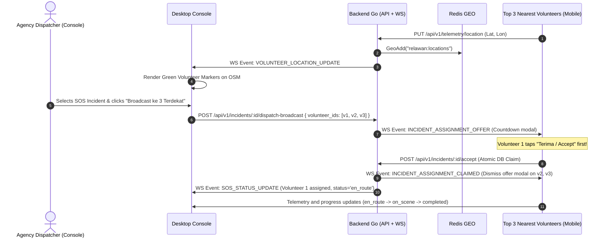

# Plan 04: Real-Time Desktop Dispatch MVP

## 1. Overview & Problem Statement
- **Target Issues**: Sub-Issues [#18](https://github.com/fadhlur-alaudin86/SiagaKita/issues/18), [#19](https://github.com/fadhlur-alaudin86/SiagaKita/issues/19), [#20](https://github.com/fadhlur-alaudin86/SiagaKita/issues/20) (Parent Issue [#37](https://github.com/fadhlur-alaudin86/SiagaKita/issues/37))
- **Problem**: Agency dispatchers currently manage incoming SOS incidents through static lists, but lack a centralized tactical dispatch center. They cannot visualize the spatial distribution of on-duty volunteers relative to active emergency coordinates, nor can they rapidly dispatch nearby volunteers to critical incidents from the Desktop Console.
- **Goal**: Build the Real-Time Dispatch MVP in `windows_console_flutter`: a split-view dispatch radar featuring OpenStreetMap, real-time telemetry streaming of on-duty volunteers via WebSocket, and a high-speed "First-Come First-Served" broadcast assignment mechanism to the top-3 nearest volunteers.

---

## 2. Architectural Design & Telemetry Flow

### 2.1 UI Layout: Split-View Dispatch Dashboard ([#18](https://github.com/fadhlur-alaudin86/SiagaKita/issues/18))
- Add `InstansiMenu.dispatchRelawan` to `instansi_shell.dart`.
- Create `windows_console_flutter/lib/features/instansi/presentation/pages/dispatch_relawan_page.dart`:
  - **Left Panel (360px)**: Active SOS Queue.
    - Incident Cards: Category icon, time elapsed, address/GPS, urgency badge, distance calculation.
    - Search & filter: Filter by incident type (medical, fire, natural disaster, search & rescue).
  - **Right Panel (Flex)**: Interactive OpenStreetMap Radar.
    - Base layer: OpenStreetMap tile provider.
    - Target marker: Selected SOS location (🔴 pulsing red pin).
    - Volunteer markers: All on-duty volunteers (🟢 green markers with user avatars/initials).
    - Proximity candidate list: Auto-sorted cards displaying the top-3 nearest available volunteers with distance in kilometers.

### 2.2 Live Telemetry Tracking ([#19](https://github.com/fadhlur-alaudin86/SiagaKita/issues/19))
- Connect `WsService` event stream to listen for `WsEvent.volunteerLocationUpdate` (`VOLUNTEER_LOCATION_UPDATE`).
- In-memory tracker in `dispatch_relawan_page.dart`:
  - Maintain map of `{ volunteerID: VolunteerMarkerData }`.
  - Stale marker cleanup: Mark volunteers as offline if no telemetry ping received within 90 seconds.
  - Smooth animation or throttled marker rendering to prevent memory leaks and high CPU usage.

### 2.3 First-Come First-Served Assignment Workflow ([#20](https://github.com/fadhlur-alaudin86/SiagaKita/issues/20)) (Aligned via `/grill-me`)
1. **Console Dispatch Action**:
   - Operator clicks **"Broadcast ke 3 Terdekat"** (or selectively checks candidates).
   - Console sends `POST /api/v1/incidents/:id/dispatch-broadcast` with `{ "volunteer_ids": ["uuid1", "uuid2", "uuid3"] }`.
2. **Targeted Real-Time Offer**:
   - Backend sends WebSocket event `INCIDENT_ASSIGNMENT_OFFER` directly to the target volunteer connections.
   - Volunteer devices show an urgent emergency modal with incident type, address, distance, and 60-second countdown.
3. **Atomic Claiming**:
   - The first volunteer to tap "Terima" calls `POST /api/v1/incidents/:id/accept`.
   - Backend uses atomic database locking to assign the volunteer:
     - `incident_responses` is created/updated with `status = 'en_route'`.
     - An instant WebSocket event `INCIDENT_ASSIGNMENT_CLAIMED` is dispatched to the remaining candidate volunteers to dismiss their dialog with the message "Misi telah diambil oleh relawan lain".
     - `SOS_STATUS_UPDATE` is broadcast to the console, transitioning tracking into `en_route`.
4. **Lifecycle Tracking**:
   - Console tracks status progression: `Assigned` -> `En Route` -> `On Scene` -> `Completed`.

---

## 3. Tasks & Implementation Checklist

### 3.1 Backend Go Tasks
- [ ] Implement `DispatchBroadcast(c *fiber.Ctx)` in `backend-go/internal/domain/incident/handler.go`.
- [ ] Implement `DispatchBroadcast` domain service logic in `backend-go/internal/domain/incident/service.go`:
  - Validate incident status is active.
  - Send `INCIDENT_ASSIGNMENT_OFFER` via WebSocket hub to selected candidate IDs.
- [ ] Ensure `AcceptIncident` in `incident/service.go` performs atomic claiming and sends `INCIDENT_ASSIGNMENT_CLAIMED` to dismissed candidates.
- [ ] Register route `incidents.Post("/:id/dispatch-broadcast", middleware.ConsoleOnly(), idempotencyMw, incidentHandler.DispatchBroadcast)` in `backend-go/cmd/api/main.go`.
- [ ] Author unit tests in `backend-go/internal/domain/incident/handler_test.go`.

### 3.2 Desktop Console Tasks
- [ ] Add `dispatchRelawan` to `InstansiMenu` enum and sidebar in `instansi_shell.dart`.
- [ ] Create `windows_console_flutter/lib/features/instansi/presentation/pages/dispatch_relawan_page.dart`.
- [ ] Wire `WsService` listener for `WsEvent.volunteerLocationUpdate`.
- [ ] Implement proximity calculation using Haversine distance from selected SOS coordinates to all online volunteers.
- [ ] Implement "Broadcast ke 3 Terdekat" action button and trigger dispatch API.
- [ ] Integrate real-time mission status tracking badge in detail pane.
- [ ] Ensure full bilingual localization in `app_localization.dart`.

### 3.3 Mobile Volunteer Client Tasks
- [ ] Listen for `INCIDENT_ASSIGNMENT_OFFER` and `INCIDENT_ASSIGNMENT_CLAIMED` in `mobile-flutter/lib/core/services/mobile_ws_service.dart`.
- [ ] Display immediate mission offer dialog with countdown and audio alert.
- [ ] Connect "Terima" button to `IncidentService.acceptSOS`.

---

## 4. Affected Components & Files

- `backend-go/internal/domain/incident/handler.go`
- `backend-go/internal/domain/incident/service.go`
- `backend-go/internal/domain/incident/model.go`
- `backend-go/cmd/api/main.go`
- `windows_console_flutter/lib/features/instansi/presentation/instansi_shell.dart`
- `windows_console_flutter/lib/features/instansi/presentation/pages/dispatch_relawan_page.dart` [NEW]
- `windows_console_flutter/lib/core/services/api_services.dart`
- `windows_console_flutter/lib/core/localization/app_localization.dart`
- `mobile-flutter/lib/core/services/mobile_ws_service.dart`
- `mobile-flutter/lib/core/services/incident_service.dart`

---

## 5. Verification & Acceptance Criteria

1. **Automated Testing & Analysis**:
   - `cd backend-go && go test -v -race -run TestDispatchBroadcast ./...`
   - `cd windows_console_flutter && flutter analyze --no-pub`
   - `cd mobile-flutter && flutter analyze --no-pub`
2. **Acceptance Criteria**:
   - Moving volunteers appear in real-time as green pins on the console map.
   - Clicking "Broadcast ke 3 Terdekat" sends offers to candidate phones simultaneously.
   - When one volunteer accepts, other phones dismiss the dialog and the console displays the assigned volunteer as `en_route`.
   - Closing Issues #18, #19, and #20 satisfies and closes Parent Issue #37.
