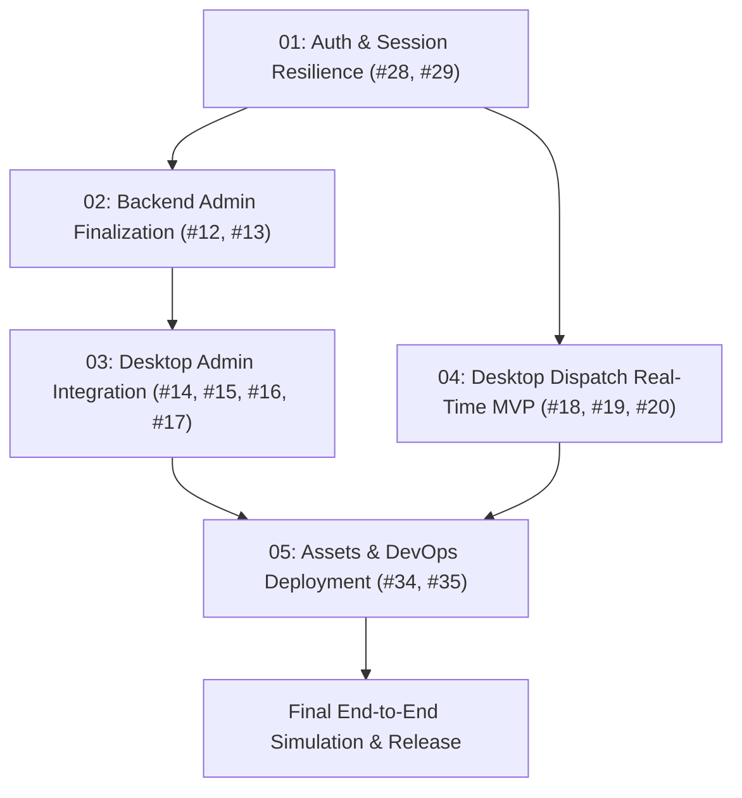

# SiagaKita Phase 1 (MVP) Implementation Roadmap

## 1. Executive Summary
This directory contains the operational implementation plans for **Phase 1 (MVP)** of SiagaKita. The objective of Phase 1 is to bring the emergency response ecosystem (Backend Go, Flutter Mobile, and Flutter Windows Desktop Console) to full operational readiness for end-to-end simulation testing and the initial production release.

All tasks outlined herein address blocking issues identified in the active GitHub repository backlog.

---

## 2. Plan Catalog & Execution Sequence

The implementation is structured into five sequential phases to ensure contracts are established before frontend consumers integrate them:

| Plan | Document | Target Issues | Parent | Primary Stack | Core Objective |
| :--- | :--- | :--- | :--- | :--- | :--- |
| **01** | [`01-auth-session-resilience.md`](./01-auth-session-resilience.md) | [#28](https://github.com/fadhlur-alaudin86/SiagaKita/issues/28), [#29](https://github.com/fadhlur-alaudin86/SiagaKita/issues/29) | [#6](https://github.com/fadhlur-alaudin86/SiagaKita/issues/6) | Go, Flutter | Transparent token rotation, preventing session timeouts during emergency operations. |
| **02** | [`02-backend-admin-finalization.md`](./02-backend-admin-finalization.md) | [#12](https://github.com/fadhlur-alaudin86/SiagaKita/issues/12), [#13](https://github.com/fadhlur-alaudin86/SiagaKita/issues/13) | [#36](https://github.com/fadhlur-alaudin86/SiagaKita/issues/36) | Go, PostgreSQL | Complete master gamification ranks CRUD and optimize analytics queries (<100ms). |
| **03** | [`03-desktop-admin-integration.md`](./03-desktop-admin-integration.md) | [#14](https://github.com/fadhlur-alaudin86/SiagaKita/issues/14), [#15](https://github.com/fadhlur-alaudin86/SiagaKita/issues/15), [#16](https://github.com/fadhlur-alaudin86/SiagaKita/issues/16), [#17](https://github.com/fadhlur-alaudin86/SiagaKita/issues/17) | [#3](https://github.com/fadhlur-alaudin86/SiagaKita/issues/3) | Flutter Desktop | Wire Admin Shell UI pages (KYC, User Management, Gamification, Stats) to backend. |
| **04** | [`04-desktop-dispatch-mvp.md`](./04-desktop-dispatch-mvp.md) | [#18](https://github.com/fadhlur-alaudin86/SiagaKita/issues/18), [#19](https://github.com/fadhlur-alaudin86/SiagaKita/issues/19), [#20](https://github.com/fadhlur-alaudin86/SiagaKita/issues/20) | [#37](https://github.com/fadhlur-alaudin86/SiagaKita/issues/37) | Flutter Desktop, Go, WS | Real-time map dispatch radar, live volunteer telemetry markers, and mission assignment. |
| **05** | [`05-assets-devops-hygiene.md`](./05-assets-devops-hygiene.md) | [#34](https://github.com/fadhlur-alaudin86/SiagaKita/issues/34), [#35](https://github.com/fadhlur-alaudin86/SiagaKita/issues/35) | [#9](https://github.com/fadhlur-alaudin86/SiagaKita/issues/9) | Assets, CI/CD | Replace placeholder siren audio, verify automated release deployment & rollback. |

---

## 3. Definition of Done (DoD) for MVP Phase 1

Before declaring Phase 1 complete and initiating end-to-end stress testing:

1. **Contract Consistency**:
   - All REST API endpoints follow the unified envelope: `{ "code": 200, "message": "...", "data": ... }`.
   - Error responses include standardized machine-readable error codes (e.g. `ERR_TOKEN_EXPIRED`, `ERR_INVALID_XP_RANGE`).
2. **Localization Governance**:
   - 100% adherence to `.agent/rules/localization.md` and `GEMINI.md`.
   - Zero hardcoded client strings; full dictionary parity (`id` and `en`) in `app_localization.dart` across both Flutter clients.
   - All unused/orphaned keys pruned.
3. **Automated Quality Verification**:
   - Backend test suite passing with race detector: `go test -v -race ./...`.
   - Zero errors or warnings in client codebases: `flutter analyze --no-pub`.
   - Database schema migration and rollback verified idempotent against clean PostgreSQL 15.
4. **Resilience & Security**:
   - JWT tokens automatically rotate; session replay attacks are blocked by Redis JTI tracking.
   - Idempotency middleware active on all state-mutating console endpoints (`X-Idempotency-Key`).
