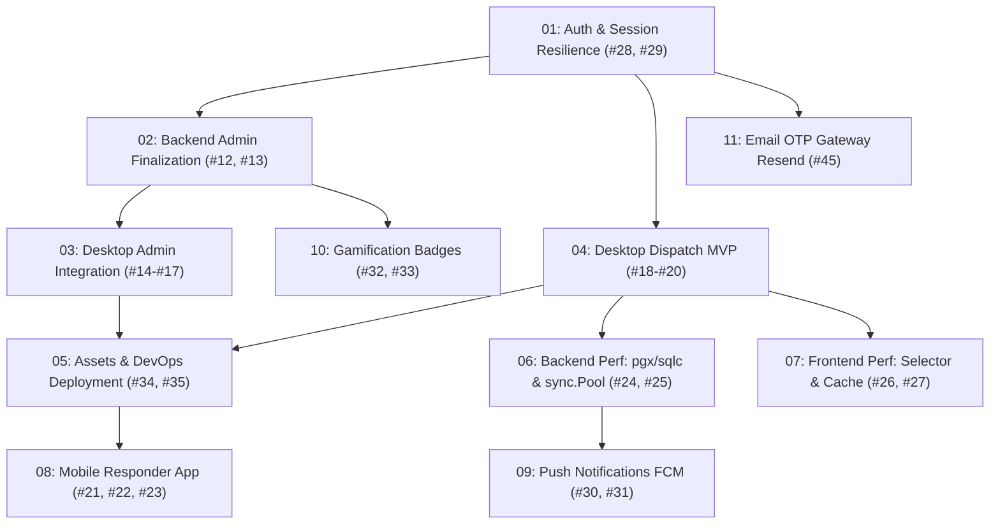

# SiagaKita Phase 1 (MVP) & Performance Roadmap

## 1. Executive Summary
This directory contains the operational technical plans for **Phase 1 (MVP)** and **Phase 2 (Performance & Scale)** of SiagaKita. The objective is to bring the emergency disaster response ecosystem (Backend Go, Flutter Mobile Citizen/Volunteer, Flutter Windows Desktop Console, and Flutter Mobile Responder) to complete production readiness with verified high-throughput resilience.

All plans are contract-first, test-driven, and trace directly to open GitHub backlog issues.

---

## 2. Plan Catalog & Execution Sequence

| Plan | Document | Target Issues | Parent | Primary Stack | Status | Core Objective |
| :--- | :--- | :--- | :--- | :--- | :--- | :--- |
| **01** | [`01-auth-session-resilience.md`](./01-auth-session-resilience.md) | [#28](https://github.com/fadhlur-alaudin86/SiagaKita/issues/28), [#29](https://github.com/fadhlur-alaudin86/SiagaKita/issues/29) | [#6](https://github.com/fadhlur-alaudin86/SiagaKita/issues/6) | Go, Flutter | ✅ Merged (`PR #60`) | Transparent token rotation, preventing session timeouts during emergencies. |
| **02** | [`02-backend-admin-finalization.md`](./02-backend-admin-finalization.md) | [#12](https://github.com/fadhlur-alaudin86/SiagaKita/issues/12), [#13](https://github.com/fadhlur-alaudin86/SiagaKita/issues/13) | [#36](https://github.com/fadhlur-alaudin86/SiagaKita/issues/36) | Go, PostgreSQL | ✅ Merged (`PR #62`) | Master gamification ranks CRUD and indexed analytics queries (<100ms). |
| **03** | [`03-desktop-admin-integration.md`](./03-desktop-admin-integration.md) | [#14](https://github.com/fadhlur-alaudin86/SiagaKita/issues/14), [#15](https://github.com/fadhlur-alaudin86/SiagaKita/issues/15), [#16](https://github.com/fadhlur-alaudin86/SiagaKita/issues/16), [#17](https://github.com/fadhlur-alaudin86/SiagaKita/issues/17) | [#3](https://github.com/fadhlur-alaudin86/SiagaKita/issues/3) | Flutter Desktop | ✅ Merged (`PR #64`) | Wire Admin Shell UI pages (KYC, User Management, Gamification, Stats) to backend. |
| **04** | [`04-desktop-dispatch-mvp.md`](./04-desktop-dispatch-mvp.md) | [#18](https://github.com/fadhlur-alaudin86/SiagaKita/issues/18), [#19](https://github.com/fadhlur-alaudin86/SiagaKita/issues/19), [#20](https://github.com/fadhlur-alaudin86/SiagaKita/issues/20) | [#37](https://github.com/fadhlur-alaudin86/SiagaKita/issues/37) | Flutter Desktop, Go, WS | ✅ Merged (`PR #65`) | Real-time map dispatch radar, live volunteer telemetry markers, and mission assignment. |
| **05** | [`05-assets-devops-hygiene.md`](./05-assets-devops-hygiene.md) | [#34](https://github.com/fadhlur-alaudin86/SiagaKita/issues/34), [#35](https://github.com/fadhlur-alaudin86/SiagaKita/issues/35) | [#9](https://github.com/fadhlur-alaudin86/SiagaKita/issues/9) | Assets, CI/CD | ✅ Merged (`PR #67`) | Replace placeholder siren audio, verify automated release deployment & rollback. |
| **06** | [`06-backend-performance-pgx-syncpool.md`](./06-backend-performance-pgx-syncpool.md) | [#24](https://github.com/fadhlur-alaudin86/SiagaKita/issues/24), [#25](https://github.com/fadhlur-alaudin86/SiagaKita/issues/25) | [#38](https://github.com/fadhlur-alaudin86/SiagaKita/issues/38) | Go, pgx, sqlc | ⏳ In Review (`PR #97`) | Eliminate telemetry memory churn via `sync.Pool` and compile Haversine queries with `sqlc`. |
| **07** | [`07-frontend-performance-selector-offline-cache.md`](./07-frontend-performance-selector-offline-cache.md) | [#26](https://github.com/fadhlur-alaudin86/SiagaKita/issues/26), [#27](https://github.com/fadhlur-alaudin86/SiagaKita/issues/27) | [#5](https://github.com/fadhlur-alaudin86/SiagaKita/issues/5) | Flutter Desktop, Mobile | 📋 Backlog (P1) | Granular state selectors for 60+ FPS and Hive/Isar embedded NoSQL offline SOS queue. |
| **08** | [`08-mobile-responder-app.md`](./08-mobile-responder-app.md) | [#21](https://github.com/fadhlur-alaudin86/SiagaKita/issues/21), [#22](https://github.com/fadhlur-alaudin86/SiagaKita/issues/22), [#23](https://github.com/fadhlur-alaudin86/SiagaKita/issues/23) | [#4](https://github.com/fadhlur-alaudin86/SiagaKita/issues/4) | Flutter Mobile | 📋 Backlog (P1) | Scaffolding `mobile-flutter-responder/`, personnel auth, mission board, and GPS navigation. |
| **09** | [`09-push-notifications-fcm.md`](./09-push-notifications-fcm.md) | [#30](https://github.com/fadhlur-alaudin86/SiagaKita/issues/30), [#31](https://github.com/fadhlur-alaudin86/SiagaKita/issues/31) | [#7](https://github.com/fadhlur-alaudin86/SiagaKita/issues/7) | Go, FCM, Flutter | 📋 Backlog (P2) | High-priority emergency broadcast push notifications waking terminated mobile devices. |
| **10** | [`10-gamification-badges.md`](./10-gamification-badges.md) | [#32](https://github.com/fadhlur-alaudin86/SiagaKita/issues/32), [#33](https://github.com/fadhlur-alaudin86/SiagaKita/issues/33) | [#8](https://github.com/fadhlur-alaudin86/SiagaKita/issues/8) | Go, Flutter Mobile | 📋 Backlog (P2) | Automated badge evaluation engine upon incident resolution and mobile profile badge grid. |
| **11** | [`11-email-otp-gateway-migration.md`](./11-email-otp-gateway-migration.md) | [#45](https://github.com/fadhlur-alaudin86/SiagaKita/issues/45) | - | Go, REST API | 📋 Backlog (P2) | Migrate email OTP gateway to Resend HTTPS REST API (port 443) with verified domain SPF/DKIM. |

---

## 3. Definition of Done (DoD) for MVP & Release

Before declaring a phase complete and deploying to production:

1. **Contract Consistency**:
   - All REST API endpoints follow the unified envelope: `{ "code": 200, "message": "...", "data": ... }`.
   - Error responses include standardized machine-readable error codes (e.g. `ERR_TOKEN_EXPIRED`, `ERR_INVALID_XP_RANGE`).
2. **Localization Governance**:
   - 100% adherence to `.agent/rules/localization.md` and `GEMINI.md`.
   - Zero hardcoded client strings; full dictionary parity (`id` and `en`) in `app_localization.dart` across all Flutter clients.
   - All unused/orphaned keys pruned.
3. **Automated Quality Verification**:
   - Backend test suite passing with race detector: `go test -v -race ./...`.
   - Zero errors or warnings in client codebases: `flutter analyze --no-pub`.
   - Database schema migration and rollback verified idempotent against clean PostgreSQL 15.
4. **Resilience & Security**:
   - JWT tokens automatically rotate; session replay attacks are blocked by Redis JTI tracking.
   - High-throughput ingestion paths utilize `sync.Pool` and direct unmarshaling.
   - Database hot paths execute via `pgxpool.Pool` and compiled `sqlc` queries.
