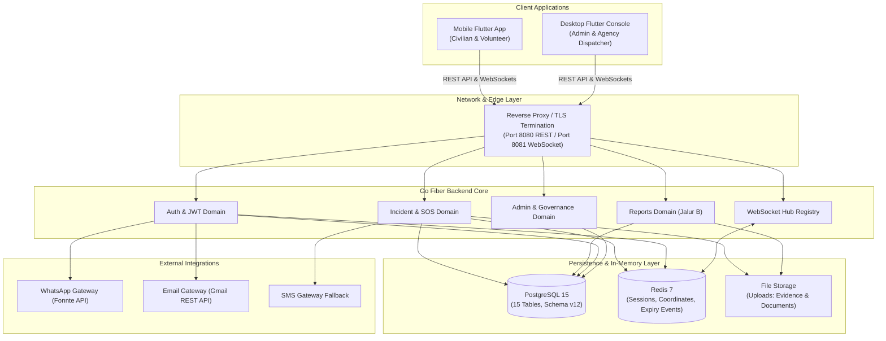

# SiagaKita System Architecture & Visual Design Catalog

Welcome to the central visual architecture and design specification catalog for **SiagaKita**.

All diagrams in this directory are authored in **Mermaid.js** directly within markdown documents. They render natively in GitHub, Antigravity IDE, and modern Markdown editors without requiring external static image exports.

---

## Diagram Catalog

| Document | Format | Description | Target Audience |
|---|:---:|---|---|
| **[Database ERD](database-erd.md)** | Mermaid `erDiagram` | Full entity-relationship diagram for **Schema v12** covering all 15 tables, column types, primary/foreign keys, and 6 ENUM types. | Backend Developers, DBAs, Data Engineers |
| **[Use Case Diagrams](use-case-diagrams.md)** | Mermaid `flowchart` | Functional boundaries and RBAC matrix across 5 user roles (Civilian, Volunteer, Agency, Admin, Superadmin) and System workers. | Product Managers, QA Engineers, Stakeholders |
| **[Activity & State Diagrams](activity-diagrams.md)** | Mermaid `sequenceDiagram` & `stateDiagram-v2` | End-to-end event sequence and state transitions for Emergency SOS (Jalur A), Community Reports (Jalur B), and KYC Verification. | Full-Stack Engineers, Mobile & Console Developers |

---

## High-Level System Architecture

---

## Living Documentation Protocol

To prevent **documentation drift**, this directory operates under the **Living Documentation** rule governed by `.agent/skills/feature-dev-workflow/SKILL.md`:

1. **Database Schema Alteration:** Any pull request adding or altering tables, columns, or foreign keys in `backend-go/migrations/` MUST update both [`docs/DATABASE_SCHEMA.md`](../DATABASE_SCHEMA.md) and [`database-erd.md`](database-erd.md).
2. **State Machine / Flow Alteration:** Any feature modifying incident statuses, grace period behaviors, or actor role permissions MUST update [`activity-diagrams.md`](activity-diagrams.md) or [`use-case-diagrams.md`](use-case-diagrams.md).
3. **Continuous Accuracy:** PR review status `status: in-review` requires these diagrams to match the implemented code.
