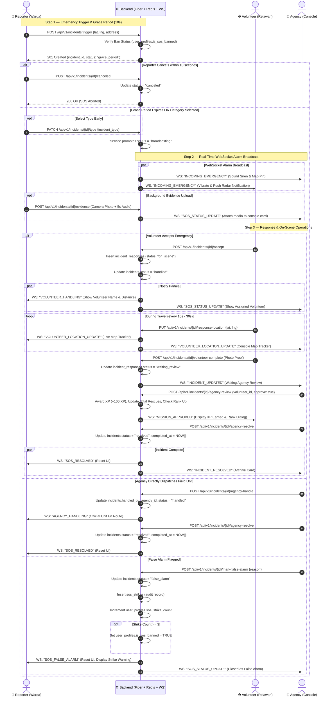
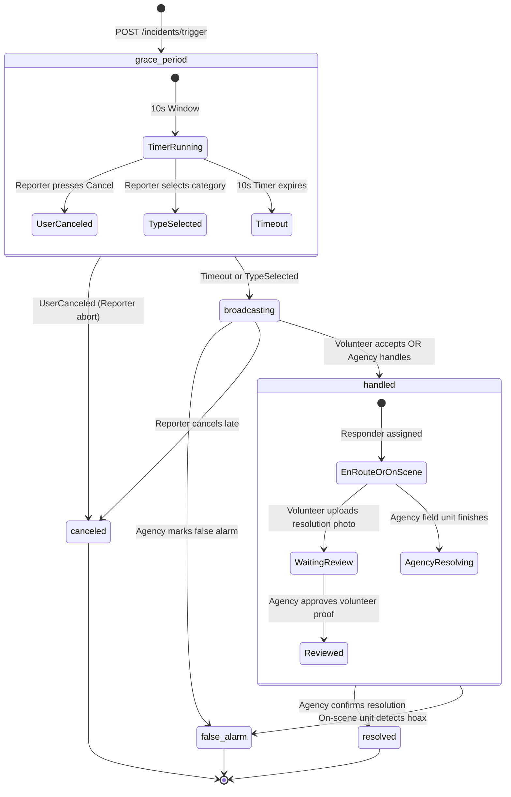
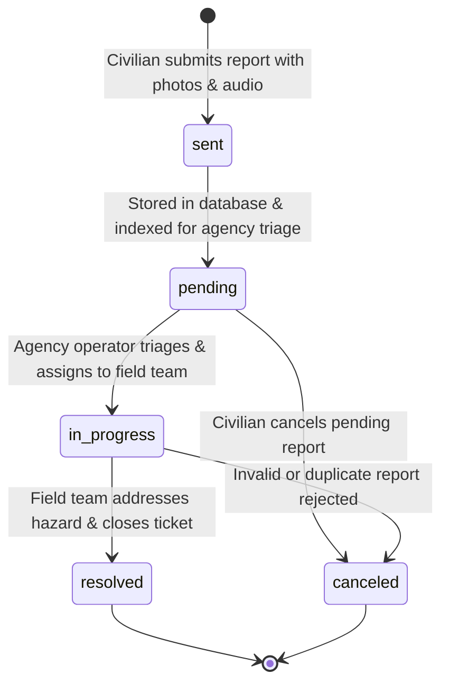
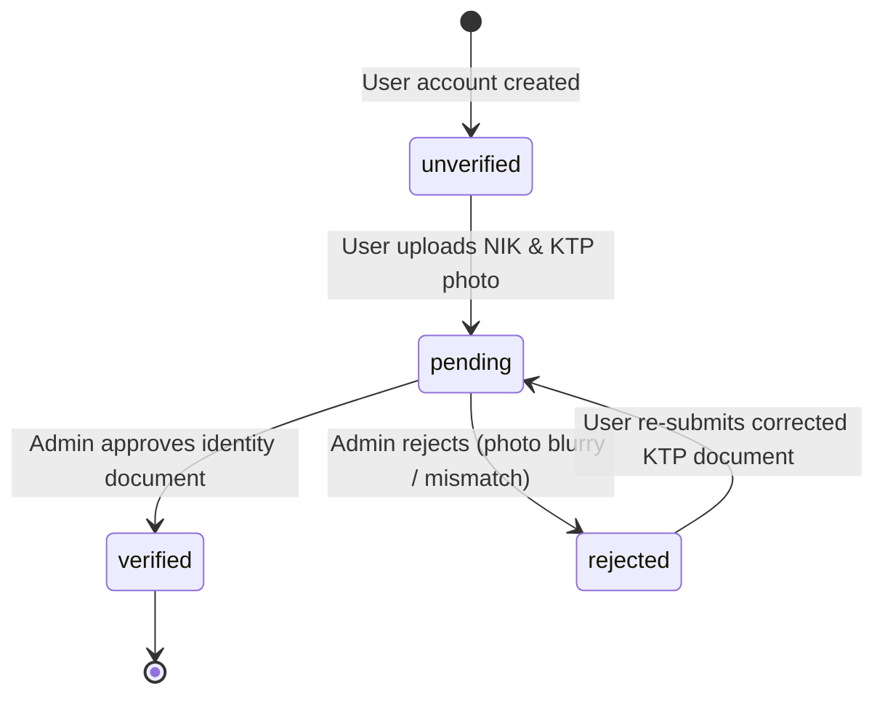
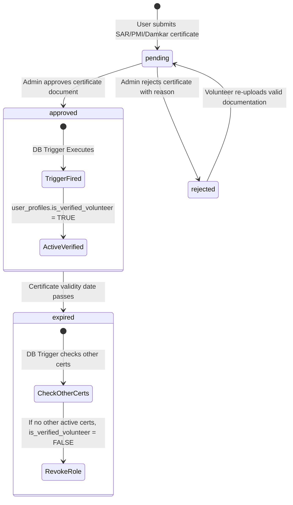

# 🔄 Activity & State Machine Diagrams — SiagaKita

> **Operational Workflows:** Real-Time Emergency Response, Incident Lifecycles, and Verification State Machines.

---

## 1. SOS Emergency Response Lifecycle (Jalur A)

The diagram below details the entire end-to-end lifecycle across the 4 key participants: **Reporter (Warga)**, **Backend (Go + Redis + WS)**, **Volunteer (Relawan)**, and **Agency (Instansi Console)**.

---

## 2. Incident State Machine (`incidents.status`)

The state machine diagram below models all permissible state transitions for emergency SOS incidents in PostgreSQL:

---

## 3. Community Hazard Report Lifecycle (Jalur B)

Unlike emergency SOS, community reports follow an asynchronous triage workflow for public incidents (potholes, fallen trees, broken streetlights, minor accidents):

---

## 4. Identity & Verification State Machines

### 4.1 Civilian NIK Verification (`user_profiles.nik_verification_status`)

### 4.2 Volunteer Certification & Verification (`volunteer_certifications.status`)

