# Database Entity-Relationship Diagram (ERD) — SiagaKita

> **Active Schema:** Schema v12 (PostgreSQL 15)  
> **Documentation Source:** [`docs/DATABASE_SCHEMA.md`](../DATABASE_SCHEMA.md)

---

## 1. Visual Entity-Relationship Diagram (Mermaid)

```mermaid
erDiagram
    %% =========================================================================
    %% Core Authentication & Unified Identity
    %% =========================================================================
    users {
        uuid id PK "gen_random_uuid()"
        varchar email UK "Unique lowercase email"
        varchar password_hash "Bcrypt hash (cost 10)"
        user_role role "superadmin, admin, agency, agency_personnel, volunteer, civilian"
        boolean is_active "Default true"
        boolean is_email_verified "Default false"
        boolean is_phone_verified "Default false"
        timestamptz created_at
        timestamptz updated_at
        timestamptz deleted_at "Soft delete"
    }

    user_profiles {
        uuid user_id PK, FK "References users(id)"
        varchar full_name
        varchar phone_number UK
        varchar nik UK "National Identity Number (16 digits)"
        varchar nik_verification_status "'unverified', 'pending', 'verified', 'rejected'"
        varchar kyc_ktp_url "KTP photo URL"
        boolean is_verified_volunteer "Auto-updated via trigger on cert approval"
        text volunteer_experience
        blood_type_enum blood_type "A, B, AB, O, UNKNOWN"
        text allergies
        text medical_conditions
        varchar emergency_contact_name
        varchar emergency_contact_phone
        int height_cm
        int weight_kg
        varchar domicile
        text bio
        varchar profile_photo_url
        int sos_strike_count "Default 0, auto-ban threshold >= 3"
        boolean is_sos_banned "Default false"
        timestamptz banned_until "Null if permanent or unbanned"
        timestamptz last_active_at "Heartbeat timestamp"
        timestamptz created_at
        timestamptz updated_at
    }

    admin_profiles {
        uuid user_id PK, FK "References users(id)"
        varchar full_name
        uuid created_by FK "References users(id), creator admin"
        timestamptz created_at
        timestamptz updated_at
    }

    emergency_contacts {
        uuid id PK "gen_random_uuid()"
        uuid user_id FK "References users(id)"
        varchar name
        varchar phone_number
        varchar relationship "Family, spouse, friend, etc."
        boolean is_priority "Default false"
        timestamptz created_at
        timestamptz updated_at
    }

    %% =========================================================================
    %% Agencies & Agency Personnel
    %% =========================================================================
    agencies {
        uuid id PK "gen_random_uuid()"
        uuid account_id UK, FK "References users(id) - agency login"
        varchar name "e.g., Polsek Tebet, Damkar Jaksel"
        agency_type type "police, fire, medical, sar"
        varchar city_code "Kemendagri regional code"
        varchar hotline_number
        float8 latitude "Base coordinates"
        float8 longitude "Base coordinates"
        timestamptz created_at
        timestamptz updated_at
    }

    agency_personnels {
        uuid id PK "gen_random_uuid()"
        uuid agency_id FK "References agencies(id)"
        uuid user_id UK, FK "References users(id)"
        varchar full_name
        varchar badge_number
        boolean is_active "Default true"
        timestamptz created_at
        timestamptz updated_at
    }

    %% =========================================================================
    %% Emergency Incidents (Jalur A) & Community Reports (Jalur B)
    %% =========================================================================
    incidents {
        uuid id PK "gen_random_uuid()"
        uuid reporter_id FK "References users(id)"
        incident_category incident_type "'medical', 'fire', 'crime', 'rescue', 'general', 'unknown'"
        float8 latitude "GPS Coordinate"
        float8 longitude "GPS Coordinate"
        incident_status status "'grace_period', 'broadcasting', 'handled', 'resolved', 'false_alarm', 'canceled'"
        text address_detail
        varchar reporter_trust_label "'verified', 'standard', 'unverified'"
        varchar urgency_level "'critical', 'high', 'medium'"
        text[] photo_paths "Post-broadcast front camera evidence"
        text audio_path "5s ambient recording"
        uuid handled_by_agency_id FK "References agencies(id)"
        varchar agency_status "'pending', 'handling', 'resolved'"
        timestamptz created_at
        timestamptz updated_at
        timestamptz completed_at
    }

    incident_responses {
        uuid id PK "gen_random_uuid()"
        uuid incident_id FK "References incidents(id)"
        uuid responder_id FK "References users(id)"
        response_status status "'en_route', 'on_scene', 'waiting_review', 'completed', 'canceled', 'rejected'"
        timestamptz accepted_at
        timestamptz completed_at
        text proof_photo_url "Mission completion proof"
        float8 latitude "Live volunteer GPS"
        float8 longitude "Live volunteer GPS"
        text address_detail
    }

    incident_reports {
        uuid id PK "gen_random_uuid()"
        uuid reporter_id FK "References users(id)"
        incident_category incident_type "'medical', 'fire', 'crime', 'rescue', 'general'"
        int urgency_level "0=low, 1=medium, 2=critical"
        float8 latitude
        float8 longitude
        text address_detail
        text description
        text[] photo_paths "Up to 3 photo attachments"
        text audio_path "Optional voice note"
        varchar status "'sent', 'pending', 'in_progress', 'resolved', 'canceled'"
        timestamptz created_at
        timestamptz updated_at
        timestamptz completed_at
    }

    sos_strikes {
        uuid id PK "gen_random_uuid()"
        uuid user_id FK "References users(id) - penalized user"
        uuid incident_id FK "References incidents(id) - false alarm SOS"
        uuid marked_by FK "References users(id) - admin or agency"
        text reason "Audit reason for strike"
        timestamptz created_at
    }

    %% =========================================================================
    %% Volunteer Gamification, Certification & Badges
    %% =========================================================================
    volunteer_certifications {
        uuid id PK "gen_random_uuid()"
        uuid user_id FK "References users(id)"
        varchar certificate_type "PMI, BASARNAS, Damkar, etc."
        text document_url
        cert_status status "'pending', 'approved', 'rejected', 'expired'"
        uuid verified_by FK "References users(id) - admin verifier"
        timestamptz verified_at
        text rejection_reason
        timestamptz expires_at
        timestamptz created_at
        timestamptz updated_at
    }

    volunteer_reputation {
        uuid user_id PK, FK "References users(id)"
        int exp_points "Default 0"
        bigint rank_id FK "References m_ranks(id)"
        int total_rescues "Default 0"
        timestamptz updated_at
    }

    m_ranks {
        bigserial id PK
        varchar rank_name UK "e.g., Novice, Scout, Veteran, Hero"
        int min_exp UK "Minimum XP required"
        text icon_url
        timestamptz created_at
    }

    m_badges {
        uuid id PK "gen_random_uuid()"
        varchar badge_name UK
        text description
        text icon_url
        timestamptz created_at
    }

    volunteer_badges_acquired {
        uuid id PK "gen_random_uuid()"
        uuid user_id FK "References users(id)"
        uuid badge_id FK "References m_badges(id)"
        timestamptz acquired_at
    }

    %% =========================================================================
    %% Relationships & Cardinalities
    %% =========================================================================
    users ||--o| user_profiles : "1:1 (Civilian/Volunteer profile)"
    users ||--o| admin_profiles : "1:1 (Admin metadata)"
    users ||--o| agencies : "1:1 (Agency account link)"
    users ||--o| agency_personnels : "1:1 (Personnel account)"
    users ||--o{ emergency_contacts : "1:N (Family & emergency contacts)"

    agencies ||--o{ agency_personnels : "1:N (Employs personnel)"
    agencies ||--o{ incidents : "0..1:N (Handles SOS)"

    users ||--o{ incidents : "1:N (Reports emergency SOS)"
    incidents ||--o{ incident_responses : "1:N (Dispatched volunteers)"
    users ||--o{ incident_responses : "1:N (Responds to SOS)"

    users ||--o{ incident_reports : "1:N (Files community reports)"
    users ||--o{ sos_strikes : "1:N (Receives penalty strikes)"
    incidents ||--o{ sos_strikes : "0..1:N (Associated incident)"
    users ||--o{ sos_strikes : "1:N (Marked by admin/agency)"

    users ||--o{ volunteer_certifications : "1:N (Applies for verification)"
    users ||--o{ volunteer_certifications : "0..1:N (Approved by admin)"

    users ||--o| volunteer_reputation : "1:1 (Volunteer XP tracking)"
    m_ranks ||--o{ volunteer_reputation : "1:N (Current rank tier)"
    users ||--o{ volunteer_badges_acquired : "1:N (Earns badge)"
    m_badges ||--o{ volunteer_badges_acquired : "1:N (Badge catalog link)"
```

---

## 2. Relational Summary by Domain

| Parent Entity | Child Entity | Cardinality | Foreign Key Constraint | Purpose |
|---|---|:---:|---|---|
| `users` | `user_profiles` | **1 : 1** | `user_id` $\rightarrow$ `users(id)` ON DELETE CASCADE | Profile, medical biodata, and NIK verification for civilian & volunteer roles. |
| `users` | `admin_profiles` | **1 : 1** | `user_id` $\rightarrow$ `users(id)` ON DELETE CASCADE | Administrative metadata and creator audit trail. |
| `users` | `agencies` | **1 : 1** | `account_id` $\rightarrow$ `users(id)` ON DELETE RESTRICT | Links the agency institution to its primary dashboard authentication account. |
| `agencies` | `agency_personnels`| **1 : N** | `agency_id` $\rightarrow$ `agencies(id)` ON DELETE CASCADE | Field responders and dispatch personnel operating under the agency. |
| `users` | `emergency_contacts`| **1 : N** | `user_id` $\rightarrow$ `users(id)` ON DELETE CASCADE | Critical contacts notified during active SOS events. |
| `users` | `incidents` | **1 : N** | `reporter_id` $\rightarrow$ `users(id)` ON DELETE RESTRICT | SOS emergencies initiated by citizen or volunteer. |
| `incidents` | `incident_responses`| **1 : N** | `incident_id` $\rightarrow$ `incidents(id)` ON DELETE CASCADE | Volunteer mission lifecycle and location tracking for an active SOS. |
| `users` | `incident_responses`| **1 : N** | `responder_id` $\rightarrow$ `users(id)` ON DELETE RESTRICT | Tracks which volunteer accepted and fulfilled the mission. |
| `users` | `incident_reports` | **1 : N** | `reporter_id` $\rightarrow$ `users(id)` ON DELETE RESTRICT | Community reports (Jalur B) for non-immediate public hazards. |
| `users` | `sos_strikes` | **1 : N** | `user_id` $\rightarrow$ `users(id)` ON DELETE CASCADE | False alarm strike history. $\ge 3$ strikes triggers automatic temporary/permanent SOS ban. |
| `users` | `volunteer_reputation`| **1 : 1** | `user_id` $\rightarrow$ `users(id)` ON DELETE CASCADE | Total XP and rescue count for verified volunteers. |
| `m_ranks` | `volunteer_reputation`| **1 : N** | `rank_id` $\rightarrow$ `m_ranks(id)` ON DELETE SET NULL | Current rank tier dynamically calculated from `exp_points`. |
| `m_badges` | `volunteer_badges_acquired`| **1 : N** | `badge_id` $\rightarrow$ `m_badges(id)` ON DELETE CASCADE | Achievement badges unlocked upon reaching mission milestones. |

---

## 3. Database Triggers & Business Integrity

1. **`trg_sync_volunteer_verified` (`volunteer_certifications`):**
   - Automatically sets `user_profiles.is_verified_volunteer = TRUE` when any certificate transitions to `'approved'`.
   - Re-checks if any approved certificate remains if a certificate status is revoked or expired.
2. **`trg_user_profiles_updated_at` & `trg_admin_profiles_updated_at`:**
   - Automatically synchronizes `updated_at = NOW()` on every update query.
3. **Denormalized Strike Counter (`user_profiles.sos_strike_count`):**
   - Maintained in `user_profiles` alongside `sos_strikes` audit log to allow $O(1)$ fast ban checks upon SOS trigger without costly table count queries.
