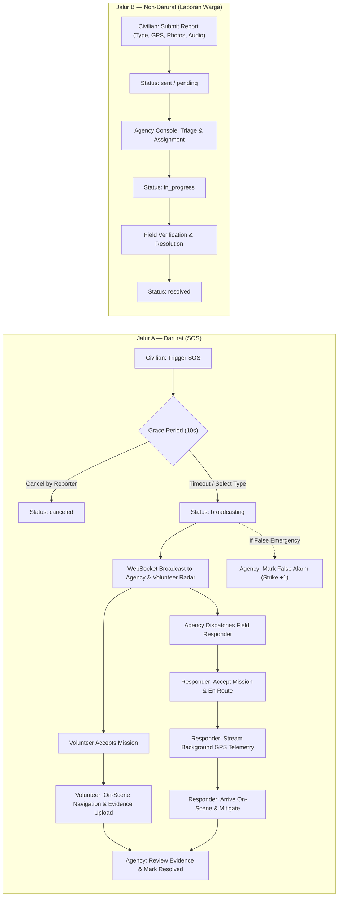
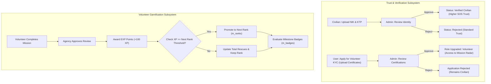

# Use Case Diagrams — SiagaKita

> **System Architecture Reference:** SiagaKita Emergency Management Platform  
> **Target Actors:** Civilian, Volunteer, Agency Dispatcher, Admin, Superadmin, and System Background Workers.

---

## 1. Actor Role Matrix

| Actor | Primary Interface | Responsibility & Capabilities |
|---|---|---|
| **Civilian (Warga)** | Mobile Flutter App | Trigger emergency SOS, manage 10s grace period, cancel SOS, submit community reports (Jalur B), manage personal medical biodata, and emergency contacts. |
| **Volunteer (Relawan)** | Mobile Flutter App | Receive real-time nearby emergency radar alerts, accept rescue missions, stream GPS coordinates, upload on-scene proof of resolution, and gain XP/Ranks. |
| **Agency Responder (Petugas Lapangan)** | Mobile Responder Flutter App | Authenticate with official badge number, monitor tactical mission board, update response status (`en_route` -> `on_scene` -> `resolved`), stream zero-churn background GPS telemetry, and navigate via OpenStreetMap/external maps. |
| **Agency (Instansi)** | Desktop Flutter Console | Monitor live municipal emergencies, dispatch field personnel, review volunteer completion evidence, resolve incidents, and penalize false alarms. |
| **Admin** | Desktop Flutter Console | Review civilian NIK KYC and volunteer certifications, manage user accounts, ban/unban abusive users, and inspect operational metrics. |
| **Superadmin** | Desktop Flutter Console / CLI | Seed and manage regional admin accounts, register emergency agencies, and configure global system settings. |
| **System Worker** | Go Fiber Backend / Redis | Enforce 10-second grace period timers, listen to Redis expired-key heartbeat events, stream WebSocket broadcasts, and parse SMS fallback coordinates. |

---

## 2. Global Use Case Diagram

```mermaid
flowchart TB
    %% Actors
    subgraph Actors["System Actors"]
        Warga["Civilian (Warga)"]
        Relawan["Volunteer (Relawan)"]
        Petugas["Agency Responder (Petugas)"]
        Instansi["Agency (Instansi / Dispatcher)"]
        Admin["Admin & Superadmin"]
        System["System Background Worker"]
    end

    %% Use Cases: Auth & Identity
    subgraph UC_Auth["1. Authentication & Identity"]
        UC_Reg["Register & Verify OTP (Email/WA)"]
        UC_Login["Login & Session Handshake"]
        UC_Bio["Update Profile & Medical Biodata"]
        UC_NIK["Submit NIK Identity Verification"]
    end

    %% Use Cases: Emergency SOS
    subgraph UC_SOS["2. Emergency SOS (Jalur A)"]
        UC_TriggerSOS["Trigger SOS Emergency"]
        UC_GracePeriod["Cancel SOS in 10s Grace Period"]
        UC_SelectType["Select Incident Category"]
        UC_StreamCoord["Stream Real-Time GPS Coordinates"]
        UC_UploadEvidence["Upload Post-Broadcast Evidence (Cam/Audio)"]
    end

    %% Use Cases: Community Reports
    subgraph UC_Report["3. Community Reports (Jalur B)"]
        UC_SubmitReport["Submit Public Hazard Report"]
        UC_CancelReport["Cancel Pending Report"]
        UC_ViewReportHistory["View Citizen Report History"]
    end

    %% Use Cases: Volunteer Operations
    subgraph UC_Volunteer["4. Volunteer Response & Gamification"]
        UC_SubmitCert["Submit Volunteer Verification KYC"]
        UC_NearbyRadar["Monitor Nearby SOS Radar"]
        UC_AcceptMission["Accept Rescue Mission"]
        UC_NavLocation["Stream Live Response Location"]
        UC_CompleteMission["Upload Resolution Proof (Photo)"]
        UC_EarnRep["Earn XP, Ranks & Badges"]
    end

    %% Use Cases: Agency Responder Tactical Operations
    subgraph UC_Responder["5. Agency Responder Tactical Operations"]
        UC_BadgeLogin["Login with Badge / Official Credentials"]
        UC_MissionBoard["Inspect Assigned Incident Missions"]
        UC_ProgressStatus["Progress Response Status (En Route, On Scene)"]
        UC_StreamTelemetry["Stream Live GPS Telemetry (sync.Pool)"]
        UC_TacticalNav["Open Turn-by-Turn External Navigation"]
    end

    %% Use Cases: Agency Dispatch
    subgraph UC_Agency["6. Agency Dispatch & Incident Command"]
        UC_LiveMap["Monitor Citywide Live Map"]
        UC_AgencyHandle["Mark SOS Handled by Agency"]
        UC_ReviewVol["Review & Approve Volunteer Response"]
        UC_ResolveSOS["Resolve SOS Incident"]
        UC_MarkFalseAlarm["Mark False Alarm & Issue Strike"]
        UC_TriageReport["Triage & Update Community Report"]
    end

    %% Use Cases: Administration
    subgraph UC_Admin["7. Administration & Security"]
        UC_ApproveKYC["Review & Approve Volunteer / NIK KYC"]
        UC_ManageAgency["Register Agency & Personnel Accounts"]
        UC_ManageAdmin["Create Regional Admin Accounts"]
        UC_ModUser["Audit Strikes, Ban / Unban Users"]
        UC_ManageMaster["Manage Ranks & Badges Catalog"]
        UC_ViewStats["View Operational Analytics & SLA"]
    end

    %% Use Cases: Background System
    subgraph UC_System["8. Automated System Operations"]
        UC_AutoBroadcast["Auto-Promote Grace Period to Broadcasting"]
        UC_WSBroadcast["Broadcast WS Event (INCOMING_EMERGENCY)"]
        UC_SMSFallback["Parse Inbound SMS Fallback Coordinates"]
        UC_SessionHeartbeat["Monitor Heartbeat & Clear Expired Sessions"]
    end

    %% Connections: Warga
    Warga --> UC_Reg
    Warga --> UC_Login
    Warga --> UC_Bio
    Warga --> UC_NIK
    Warga --> UC_TriggerSOS
    Warga --> UC_GracePeriod
    Warga --> UC_SelectType
    Warga --> UC_StreamCoord
    Warga --> UC_UploadEvidence
    Warga --> UC_SubmitReport
    Warga --> UC_CancelReport
    Warga --> UC_ViewReportHistory

    %% Connections: Relawan
    Relawan --> UC_Reg
    Relawan --> UC_Login
    Relawan --> UC_SubmitCert
    Relawan --> UC_NearbyRadar
    Relawan --> UC_AcceptMission
    Relawan --> UC_NavLocation
    Relawan --> UC_CompleteMission
    Relawan --> UC_EarnRep

    %% Connections: Agency Responder
    Petugas --> UC_BadgeLogin
    Petugas --> UC_MissionBoard
    Petugas --> UC_ProgressStatus
    Petugas --> UC_StreamTelemetry
    Petugas --> UC_TacticalNav

    %% Connections: Instansi
    Instansi --> UC_Login
    Instansi --> UC_LiveMap
    Instansi --> UC_AgencyHandle
    Instansi --> UC_ReviewVol
    Instansi --> UC_ResolveSOS
    Instansi --> UC_MarkFalseAlarm
    Instansi --> UC_TriageReport

    %% Connections: Admin & Superadmin
    Admin --> UC_Login
    Admin --> UC_ApproveKYC
    Admin --> UC_ManageAgency
    Admin --> UC_ManageAdmin
    Admin --> UC_ModUser
    Admin --> UC_ManageMaster
    Admin --> UC_ViewStats

    %% Connections: System
    System --> UC_AutoBroadcast
    System --> UC_WSBroadcast
    System --> UC_SMSFallback
    System --> UC_SessionHeartbeat
```

---

## 3. Subsystem Breakdown

### 3.1 Emergency Operations (Jalur A vs Jalur B)

### 3.2 Governance, Gamification & Trust Flow

